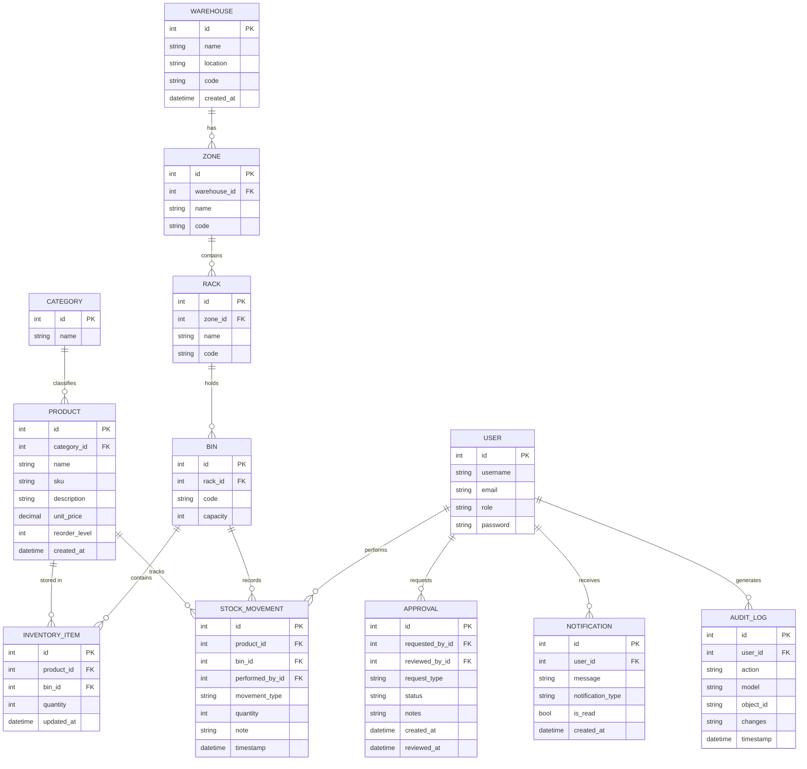

# ER Diagram — Warehouse Space Optimization System

```mermaid
erDiagram
    USER {
        int id PK
        string username
        string email
        string role
        string password
    }

    WAREHOUSE {
        int id PK
        string name
        string location
        string code
        datetime created_at
    }

    ZONE {
        int id PK
        int warehouse_id FK
        string name
        string code
    }

    RACK {
        int id PK
        int zone_id FK
        string name
        string code
    }

    BIN {
        int id PK
        int rack_id FK
        string code
        int capacity
    }

    CATEGORY {
        int id PK
        string name
    }

    PRODUCT {
        int id PK
        int category_id FK
        string name
        string sku
        string description
        decimal unit_price
        int reorder_level
        datetime created_at
    }

    INVENTORY_ITEM {
        int id PK
        int product_id FK
        int bin_id FK
        int quantity
        datetime updated_at
    }

    STOCK_MOVEMENT {
        int id PK
        int product_id FK
        int bin_id FK
        int performed_by_id FK
        string movement_type
        int quantity
        string note
        datetime timestamp
    }

    APPROVAL {
        int id PK
        int requested_by_id FK
        int reviewed_by_id FK
        string request_type
        string status
        string notes
        datetime created_at
        datetime reviewed_at
    }

    NOTIFICATION {
        int id PK
        int user_id FK
        string message
        string notification_type
        bool is_read
        datetime created_at
    }

    AUDIT_LOG {
        int id PK
        int user_id FK
        string action
        string model
        string object_id
        string changes
        datetime timestamp
    }

    WAREHOUSE ||--o{ ZONE : "has"
    ZONE ||--o{ RACK : "contains"
    RACK ||--o{ BIN : "holds"
    CATEGORY ||--o{ PRODUCT : "classifies"
    PRODUCT ||--o{ INVENTORY_ITEM : "stored in"
    BIN ||--o{ INVENTORY_ITEM : "contains"
    PRODUCT ||--o{ STOCK_MOVEMENT : "tracks"
    BIN ||--o{ STOCK_MOVEMENT : "records"
    USER ||--o{ STOCK_MOVEMENT : "performs"
    USER ||--o{ APPROVAL : "requests"
    USER ||--o{ NOTIFICATION : "receives"
    USER ||--o{ AUDIT_LOG : "generates"
```